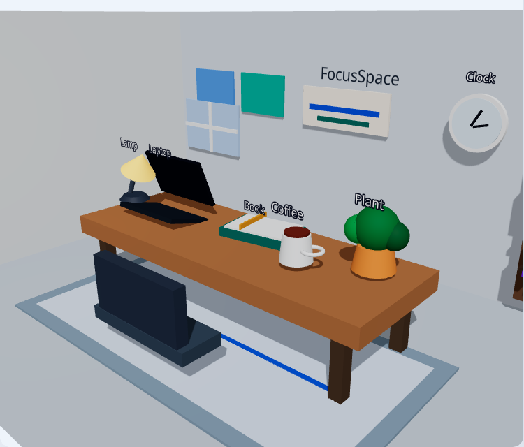

# FocusSpace — 3D Study Room

Interactive study room with **React Three Fiber**. Click desk objects to switch focus modes, toggle day/night, and run a Pomodoro timer.

**Portfolio:** https://hawk327ml.github.io/  
**Live (GitHub Pages):** https://hawk327ml.github.io/focusspace-3d/



## What you can do

- Click **laptop / book / coffee / plant / lamp / clock** to switch focus modes + tips
- Toggle **day / night** lighting and UI theme
- Run an on-page **Pomodoro** timer while looking at the room
- Orbit / zoom the 3D desk scene (desktop + touch)

## Stack

| Layer | Tech |
|-------|------|
| UI | React 18, Tailwind, DaisyUI (`focus` / `focusday`) |
| 3D | Three.js · `@react-three/fiber` · `@react-three/drei` |
| Build | Vite (`base: './'`) |
| Hosting | **GitHub Pages** (primary) |

## Local

```bash
npm install
npm run dev
```

```bash
npm run build
npm run preview
```

## Deploy

Push to `main` → Actions (`.github/workflows/deploy-pages.yml`) publishes Pages.

### Firebase (optional, currently unused)

`https://focusspace-3d.web.app` is **not** the active Live (site may 404 until you deploy). If you use Firebase later:

```bash
firebase use daisy-c2db8
firebase deploy --only hosting:focusspace
```

**Never** run bare `firebase deploy`. Spot-check Rosemary / FocusSpace / Luna Live URLs after any multi-app Hosting change.

## Author

Hawk327ml · Multimedia Computing · UPM
